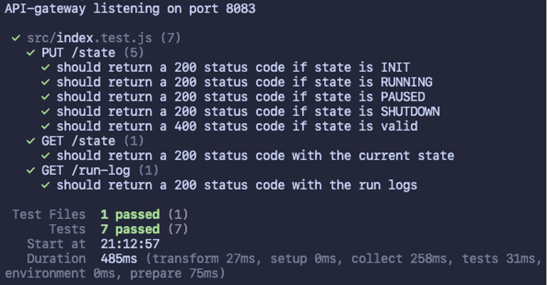
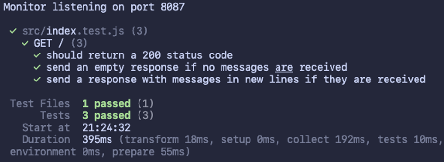
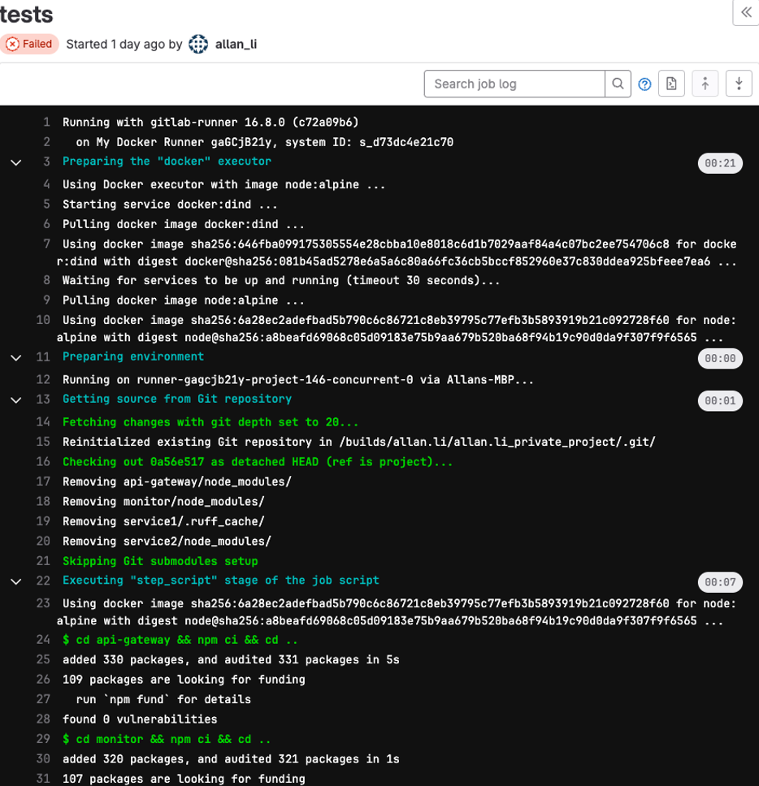
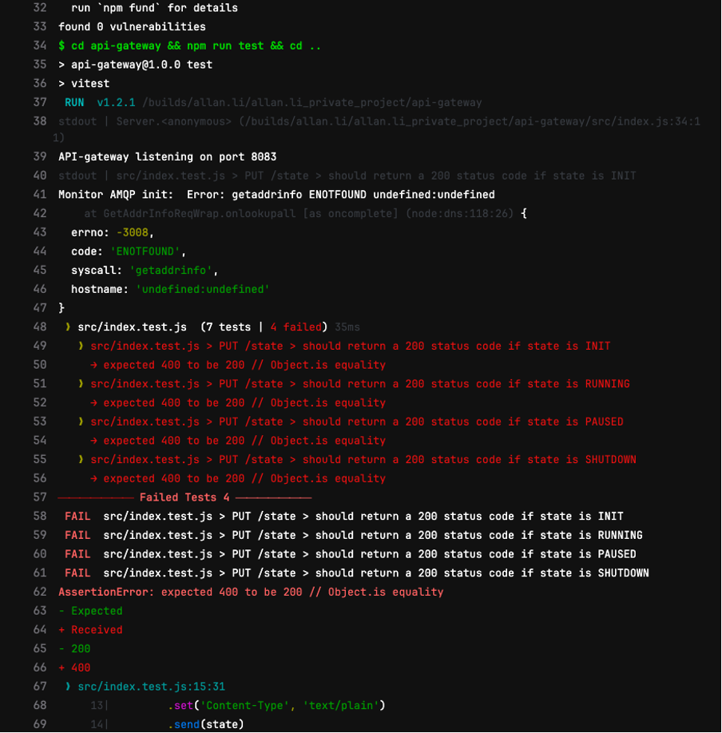
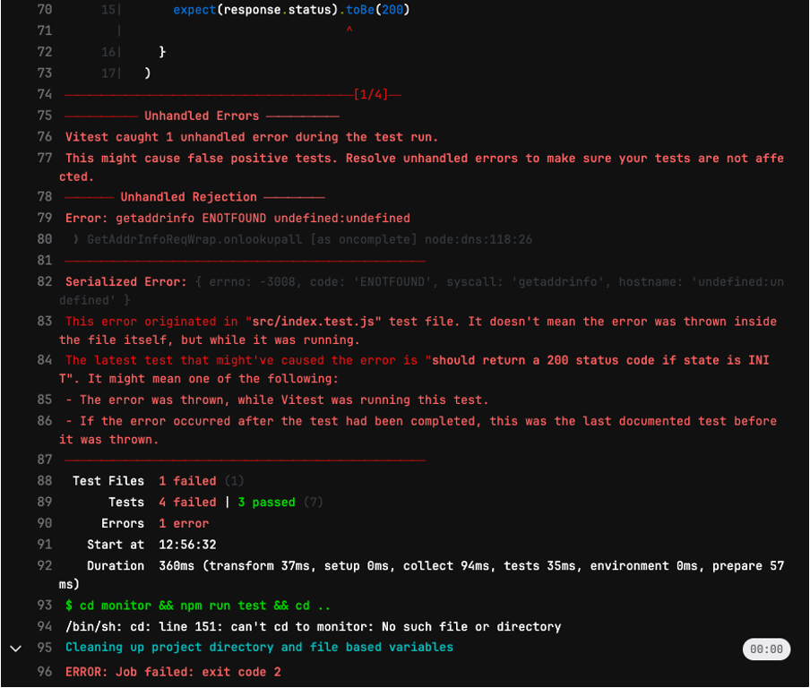
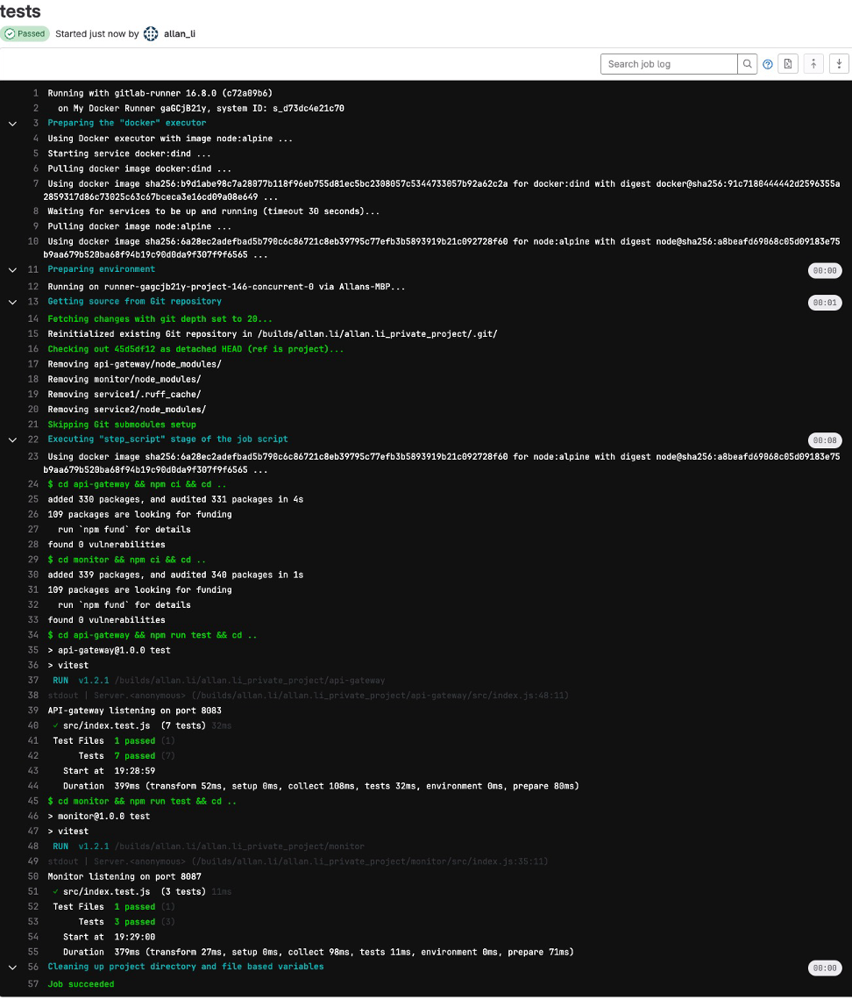

# COMP.SE.140 - Allan Li - al431949

# Project

## 1. Instructions for the teaching assistant

### 1.1 Implemented optional features

Implemented static analysis step in the pipeline. The tools used include ESLint for JavaScript linting and Ruff for Python linting.

### 1.2 Instructions for examiner to test the system

The system can be initialized and tested locally by running `docker compose up --build` in the terminal.

## 2. Description of the CI/CD pipeline

### 2.1 Version management

This project can be found in the “project” branch of the repository. The branch utilizes a three stage CI/CD pipeline which builds, tests, and deploys the project services. The pipeline kicks in automatically when changes are pushed to the branch.

### 2.2 Build tools

The build step includes linting and code formatting. For JavaScript services, ESLint is used for linting and Prettier used for code formatting. For the Python service, Ruff was chosen for both linting and code formatting.

### 2.3 Testing: tools and test cases

Testing for the project mostly involved writing positive and negative tests for various API endpoints. The testing for the project was conducted using Vitest and Supertest for both the API-gateway service and monitor service. Test-driven development practices were utilized for facilitating the implementation of the API-gateway functionalities.

#### 2.3.1 API-gateway test cases

Figure 1 - API-gateway test cases

#### 2.3.2 Monitor test cases

Figure 2 - Monitor test cases

## 3. Example runs of the pipeline

### 3.1 Failing tests

Figure 3 - Failing tests 1/3

Figure 4 - Failed tests 2/3

Figure 5 - Failed tests 3/3

### 3.2 Passing tests

Figure 6 - Passing tests

## 4. Reflections

### 4.1 Main learnings and worst difficulties

1. GitLab runner – the CI/CD pipeline was implemented and tested on the secondary course GitLab instance. While instructions were available for setting up the GitLab runner with a self-signed certificate, the process was still confusing and time-consuming.
2. Docker daemon socket on macOS – On macOS, Docker Desktop does not set up a `/var/run/docker.sock`file by default. This resulted in errors being thrown when running jobs on GitLab, as GitLab could not find the runner’s Docker executor.
3. Python multithreading for non-blocking processes – Python threads were a novel concept for me prior to working on this project, and I spent a significant amount of time writing working code for handling state changes in the Python service. In the end, I figured out how to have two separate threads running in addition to the main thread. One was used to consume state change messages from RabbitMQ, and the other was used to process a message loop that reacts to the state changes.
4. Docker-in-docker – Docker-in-docker was also unknown territory for me, but thankfully there were many resources available for writing a proper CI config file that utilized docker-in-docker. In the end, I managed to make it work.
5. API testing – my experience with testing mostly consisted of frontend testing prior to this project. Now I have also gotten the chance to try out some backend/API testing, specifically with tools such as Supertest.

### 4.2 Amount effort (hours) used

I spent around 40 hours on this project.

## uname -a

Darwin Allans-MBP 23.0.0 Darwin Kernel Version 23.0.0: Fri Sep 15 14:41:43 PDT 2023; root:xnu-10002.1.13~1/RELEASE_ARM64_T6000 arm64

## docker --version

Docker version 24.0.7, build afdd53b

## docker-compose --version

Docker Compose version v2.23.3-desktop.2
